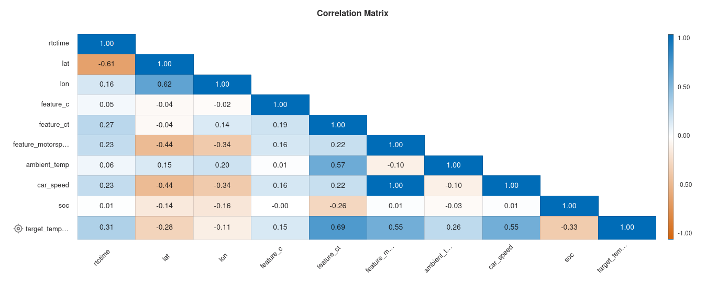
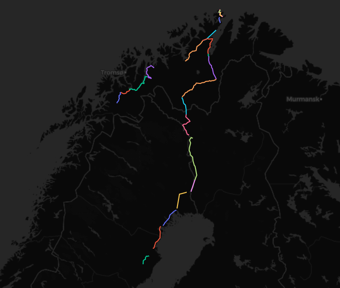
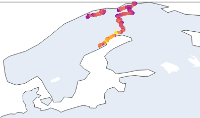

# Hackaburg 2023 - ODEoptimizers

ML data prediction of timeseries driving data

## data insights

## tasks

* [X] Getting data insights
* [X] ~~Copying data into influx db~~
* [X] Splitting data in test and training data
* [X] Choosing a model => ODE
* [X] Try AWS SageMaker Canvas, DataWrangler, Studio AutoML
