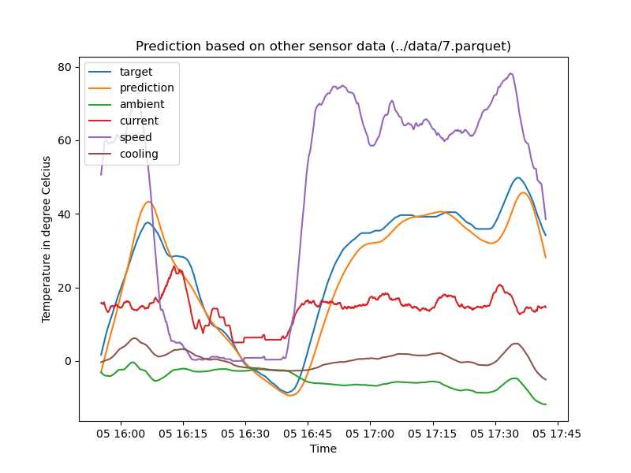

# Hackaburg 2023 - ODEoptimizers

Data prediction of timeseries driving data with a ordinary differential equation (ODE)

<https://devpost.com/software/odeoptimizers>

## data insights

Following the data to the Nordkapp

<!--  -->

## physical model

## steps

* splitting data in time consistent chunks
* smoothing data  
    
  
* prediction  
  
  

## results

Overfitting? No: We created a physical model that tries to align with the real world. It is not influenced by the training data.

=> Validation with other data

## further steps

* Use more data to find the coefficients
* Feed model with real time finetuned coefficients from a ML-model
* Car specific coefficients using a ML-model
* Test under less extreme driving conditions

<!-- ## tasks

* [X] Getting data insights
* [X] ~~Copying data into influx db~~Car specific coefficients
using a ML-model
* [X] Splitting data in test and training data
* [X] Choosing a model => ODE
* [X] Try AWS SageMaker Canvas, DataWrangler, Studio AutoML -->
