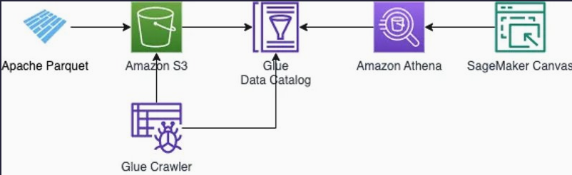
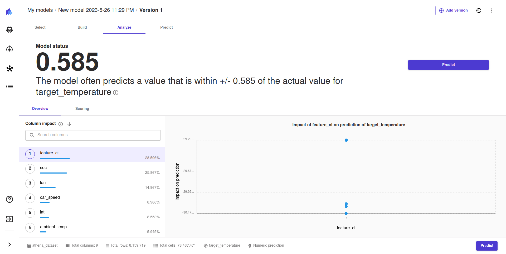

# Creating a low code model in SageMaker Canvas

## Architecture

(Source: <https://dgallitelli95.medium.com/no-code-machine-learning-ml-on-parquet-files-with-amazon-sagemaker-canvas-and-amazon-athena-235bf8f029c3>)

## Model experiment

## Evaluation

Canvas does not have the option to specify the data as timeseries and thus is no optimal solution.
